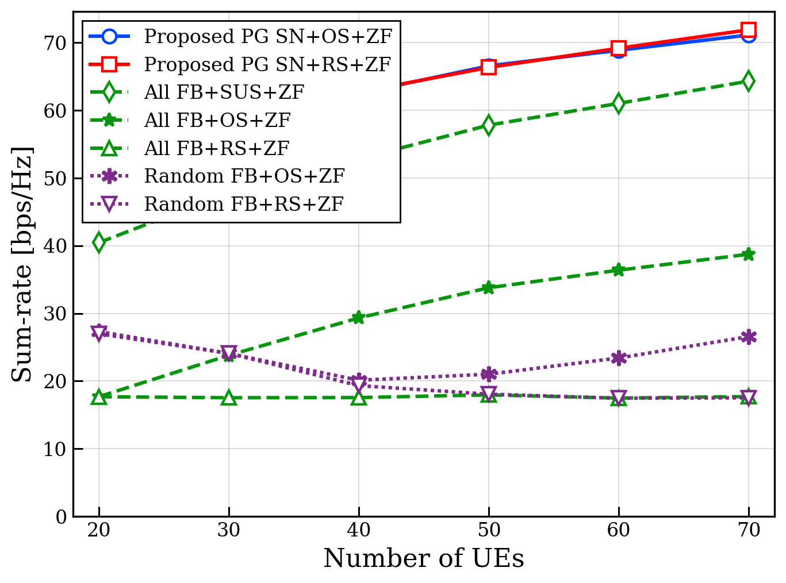

# Self-Nomination: Deep Learning for Decentralized CSI Feedback Reduction in MU-MIMO Systems

This `selfnomination_project/` directory is the paper-oriented code release for the self-nomination framework in:

Juseong Park, Foad Sohrabi, Jinfeng Du, and Jeffrey G. Andrews, "Self-Nomination: Deep Learning for Decentralized CSI Feedback Reduction in MU-MIMO Systems," IEEE Transactions on Wireless Communications, 2026.

The goal is to reduce uplink CSI feedback in a MU-MIMO downlink by letting each user equipment (UE) decide, from its own downlink channel observation, whether it should feed back CSI to the base station (BS). The BS then schedules up to `K` users from the nominated set and designs a ZF or RZF precoder from the CSI that was actually reported.

This release follows the core setting in the paper:

- self-nomination is decided locally at each UE
- the same nomination network is shared across users
- the learning objective is downlink sum-rate under an average feedback budget
- nominated UEs are assumed to send unquantized CSI so the effect of nomination can be isolated from CSI compression

The paper reports that self-nomination can substantially reduce CSI feedback, with reductions up to about 65% while preserving sum-rate and fairness performance.

## Example Figure

The repository includes a paper-style example plot generated from the provided evaluation scripts:



This figure corresponds to a `num_users` sweep with `M=30`, `K=20`, and `SNR=15 dB`, comparing proposed self-nomination models against full-feedback and random-feedback baselines.

## Overview

The pipeline implemented here is:

1. Each UE observes its own channel vector `h_k`.
2. A shared neural network outputs a binary self-nomination decision.
3. The BS collects CSI only from nominated UEs.
4. A scheduler selects up to `K` users from the nominated set.
5. ZF or RZF beamforming is applied and the downlink rate is evaluated.

In code, the average feedback constraint is controlled by `M`, the maximum number of scheduled users is `K`, and the total number of candidate UEs is `num_users`.

## Paper-to-Code Mapping

| Paper concept | Code variable | Meaning |
| --- | --- | --- |
| Total number of UEs | `num_users` | Candidate users in the cell |
| BS antennas | `Nt` | Number of transmit antennas |
| Scheduled-user limit | `K` | Maximum number of users served per slot |
| Feedback budget | `M` | Average number of nominated users |
| Noise power | `noise_pwr` | Derived from `SNR_dB` |
| Training epochs | `num_epochs` | Number of optimization epochs |

The main system and training parameters live in [`selfnomination_project/config.py`](./config.py).

## What Is Implemented in `selfnomination_project/`

- Two nomination inputs:
  - `full`: full complex channel vector, using real and imaginary parts
  - `chg_input`: channel-gain-only input, used as a lightweight CQI-like baseline
- Two training strategies from the paper:
  - `reinforce`: stochastic Bernoulli nomination with policy gradients
  - `directgrad`: direct optimization with surrogate gradients for hard nomination decisions
- BS-side processing:
  - scheduling: `random` or `greedy` during training
  - beamforming: `zf` or `rzf`
- Evaluation and baseline comparison:
  - learned self-nomination models
  - full-feedback baselines with `random`, `greedy`, `exhaustive`, `pf`, and `sus` scheduling

## Scope Note

The main training entry point, [`selfnomination_project/main.py`](./main.py), matches the core training setup used in the paper and supports:

- `--method`: `reinforce`, `directgrad`
- `--input_type`: `full`, `chg_input`
- `--scheduling`: `random`, `greedy`
- `--beamforming`: `zf`, `rzf`

The paper also discusses a fairness-aware extension based on proportional-fair scheduling. What is not included here is the dynamic PF experiment path from the paper. In [`selfnomination_project/test_unified.py`](./test_unified.py), the `pf` option is available for evaluation, but it uses randomly generated weights rather than a dynamic PF weight evolution across time.

## Directory Layout

```text
selfnomination_project/
├── README.md
├── requirements.txt
├── check_imports.py
├── config.py
├── loaders.py
├── main.py
├── test_unified.py
├── result/
│   └── save_fig/
│       ├── UMi_UPA_num_users_sweep_M30_K20_SNR15.png
│       ├── num_users_sweep_raw/
│       └── snr_sweep_raw/
├── baseline_methods/
│   ├── __init__.py
│   ├── sched_bf_modules.py
│   └── sched_bf_modules_gpu.py
└── learning_modules/
    ├── __init__.py
    ├── reinforce_full_input.py
    ├── reinforce_channel_gain_input.py
    ├── direct_gradient_full_input.py
    └── direct_gradient_channel_gain_input.py
```

## Installation

From the repository root:

```bash
python3 -m venv .venv
source .venv/bin/activate
pip install -r selfnomination_project/requirements.txt
python3 selfnomination_project/check_imports.py
```

If you prefer to work from inside `selfnomination_project/`, just remove the `selfnomination_project/` prefix from the commands below.

## Datasets

The loader supports the following channel modes:

- `RF`: synthetic Rayleigh fading generated in memory
- `UMi_UPA`
- `UMi_ULA`
- `Berlin_UPA`
- `RMa_UPA`

For the 3GPP-style modes, dataset paths are resolved in [`selfnomination_project/loaders.py`](./loaders.py). The loader checks `DATASET_ROOT` first and otherwise falls back to the local default path configured in that file.

Example:

```bash
export DATASET_ROOT=/path/to/datasets
```

The expected dataset subtree is the one referenced by [`selfnomination_project/loaders.py`](./loaders.py), including the `Data_Narrowband(CH+UEposition)_Nt32_Nr1/` folder used by the paper-aligned experiments.

## Training

The training script is [`selfnomination_project/main.py`](./main.py).

### Arguments

| Argument | Choices | Description |
| --- | --- | --- |
| `--method` | `reinforce`, `directgrad` | Nomination training method |
| `--input_type` | `full`, `chg_input` | UE-side input representation |
| `--scheduling` | `random`, `greedy` | BS scheduling used during training |
| `--beamforming` | `zf`, `rzf` | Precoding method |
| `--channel_mode` | `RF`, `UMi_UPA`, `UMi_ULA`, `Berlin_UPA`, `RMa_UPA` | Channel model |
| `--gpu_id` | e.g. `0` | CUDA device id |

### Example Commands

Train the full-channel REINFORCE model on UMi UPA:

```bash
python3 selfnomination_project/main.py --method reinforce --input_type full --scheduling greedy --beamforming zf --channel_mode UMi_UPA --gpu_id 0
```

Train the channel-gain direct-gradient model on Rayleigh fading:

```bash
python3 selfnomination_project/main.py --method directgrad --input_type chg_input --scheduling greedy --beamforming rzf --channel_mode RF --gpu_id 0
```

### Training Outputs

Training writes:

- checkpoints to `./result/save_model/`
- training curves to `./result/save_parameter/`

These output paths are relative to your current working directory when you launch the script.

## Evaluation

The evaluation script is [`selfnomination_project/test_unified.py`](./test_unified.py). It can evaluate:

- a learned self-nomination model
- a full-feedback baseline without nomination

### Learned-Model Evaluation

```bash
python3 selfnomination_project/test_unified.py \
  --method reinforce \
  --input_type full \
  --scheduling greedy \
  --beamforming zf \
  --channel_mode UMi_UPA \
  --model_path ./result/save_model/UMi_UPA/Ne150_Nt32_UE50_M30_K20_REINFORCE_inH_Greedy_ZF_UMi_UPA_best.pth
```

### Baseline Evaluation

```bash
python3 selfnomination_project/test_unified.py \
  --method baseline \
  --scheduling greedy \
  --beamforming zf \
  --channel_mode UMi_UPA \
  --num_test_samples 100
```

### Baseline Scheduling Options

When `--method baseline` is used, the script supports:

- `random`
- `greedy`
- `exhaustive`
- `pf`
- `sus`

For the current `pf` option in [`selfnomination_project/test_unified.py`](./test_unified.py), the weights are randomly generated inside the script. This is useful for a PF-style weighted evaluation, but it is not the dynamic PF experiment protocol discussed in the paper.

The evaluation script reports mean and standard deviation for:

- sum-rate
- number of nominated users
- number of scheduled users
- orthogonality defect
- channel-matrix condition number

Results are saved under `./result/save_testresult/`.

## Reproducibility Notes

- Train/validation/test splits are defined in [`selfnomination_project/config.py`](./config.py).
- `RF` mode does not require external files.
- The nomination budget is enforced through a learned dual variable in the training modules.
- `full` input is the paper-aligned spatially aware self-nomination model.
- `chg_input` is the reduced-information alternative based only on channel magnitude.
- The `random` and `greedy` scheduling choices in [`selfnomination_project/main.py`](./main.py) are consistent with the training setup used in the paper.
- The dynamic PF experiment path described in the paper is not included in this release.

## Citation

If you use this release in academic work, please cite the paper:

```bibtex
@ARTICLE{11351314,
  author={Park, Juseong and Sohrabi, Foad and Du, Jinfeng and Andrews, Jeffrey G.},
  journal={IEEE Transactions on Wireless Communications}, 
  title={Self-Nomination: Deep Learning for Decentralized CSI Feedback Reduction in MU-MIMO Systems}, 
  year={2026},
  volume={25},
  number={},
  pages={10321-10336},
  keywords={Downlink;Optimization;Uplink;Training;Signal to noise ratio;Precoding;Channel estimation;Throughput;Dynamic scheduling;6G mobile communication;6G mobile communication;mid-band;multiple-input multiple-output;deep learning;channel state information;feedback communications},
  doi={10.1109/TWC.2026.3651229}}
```
